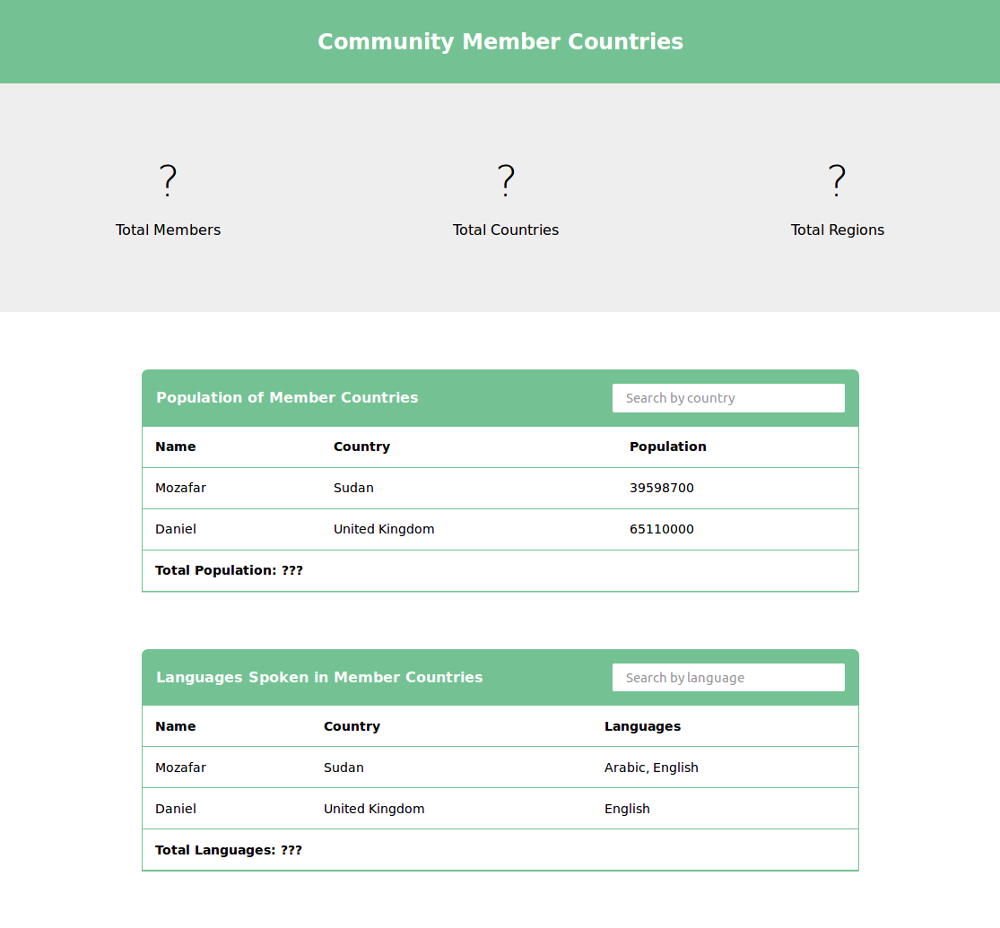

# Countries App

This repository contains initial work on an app for your organisation, which will help them learn more about the countries where their members are from. To complete the app, you'll need to add functionality to list members from the data set and search by member information.

You will need to look up information about the countries. You can get this information from the API at [https://restcountries.eu/](https://restcountries.eu/).

This repository is part of CodeYourFuture's [group projects](https://github.com/CodeYourFuture/group-projects).

## What you need to do

- Replace the "?" at the top with the correct number of total members, total countries, and total regions from the `/data/members.js` dataset. Country regions are available in the API data.
- Implement the "Population of Member Countries" using the `/data/members.js` dataset. Country populations are available in the API data. Don't forget the Total Population count at the bottom.
- Implement the "Languages Spoken in Member Countries" using the `/data/members.js` dataset. Country languages are available in the API data. Don't forget the Total Languages count at the bottom.
- When the user searches the "Population of Member Countries" table, it should only show members from countries that match the search phrase.
- When the user searches the  "Languages Spoken in Member Countries" table, it should only show members with languages that match the search phrase.

## Stretch goals
- Sort the population table so that the members with the highest population appear first.
- Sort the languages table so that the members with the most languages appear first.
- Add a form for adding a new member. When a new member is updated, all of the tables and the statistics at the top should update.
- Add buttons for each region that has at least one member. When clicked, all of the tables and the statistics at the top should only include members from that country.
