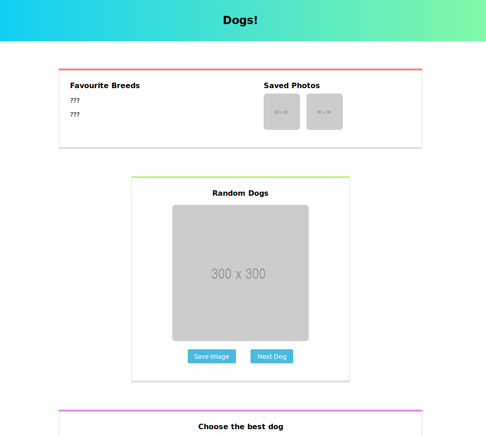

# Dogs App

This repository contains the initial code for a React app about dogs. To complete the app, you'll need to add the functionality for saving photos, choosing the best dog, and browsing dog breeds.

You will need to get images of dogs from the API at [https://dog.ceo/dog-api/documentation/](https://dog.ceo/dog-api/documentation/).

This repository is part of CodeYourFuture's [group projects](https://github.com/CodeYourFuture/group-projects).

## What you need to do

- Show a random picture of a dog in the "Random Dogs" panel. When the "Next Dog" button is clicked, show a new random picture of a dog.
- When the "Save Image" button is clicked, this image should be added to the Saved Photos area.
- Show two pictures of dogs in the "Choose the best dog" panel. Each picture should come from a different dog breed. When the user selects a "Best Dog", it should treat it like a "vote" for that dog breed. Display how many "votes" each dog breed gets below the images.
- In the "Select a Breed" panel, show a random picture from the breed in the select dropdown. When the user selects a new breed, show a random picture from that breed.
- When the "Show me more!" button is clicked, show another random picture from the breed in the select dropdown.

## Stretch goals

- At the top, replace the ??? with a list of the top five dog breeds according to how many "votes" they get in the "Choose the best dog" panel.
- Allow the user to select _any_ breed in the "Select a Breed" panel by loading all the possible breeds from the API.
