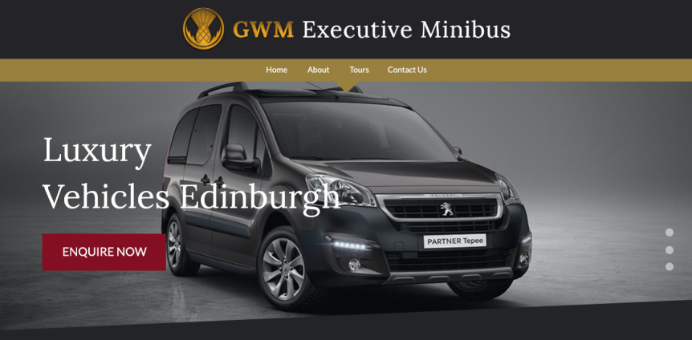

# GWM - Build a Luxury Vehicles Website

You work in a small, creative web development agency that has been hired to create a new website for GWM, a luxury van hire company. The project manager and the designer on your team have worked together to create a design mockup of the site. The client has signed off and now it's your job to turn the design into a website using HTML, CSS and JavaScript.

## First Steps

1. Look over the [design mockup](mockups) and [resources](resources) to see if you have all the information you need to build the website. Ask for any information or resources you're missing to do your job.
2. Discuss how the project can be divided up into separate tasks and assign responsibilities.
3. Read the rest of this document before beginning.

## Final Product

When you complete the project, we'll expect the following:

1. A new git repository with an HTML page we can load and view. All students in the group should have contributed to this repository via Pull Requests.
2. A responsive design that is easy to use on mobile phones, tablets and laptops.
3. Attention to detail when implementing the designer's typography, colors, layout and photos. (See the [style guide](mockups/style-guide.png))
4. Clean, semantic HTML code.
5. Well-structured CSS code that makes use of re-usable components.
6. Under the "Take a tour with us..." section, each "Read More" button should reveal a pop-up (sometimes called a "modal") with more information about the tour, including the number of hours it takes. (You can make up the information and the hours.) Each tour details should include a small form to select a date and a button to "Book Tour".
7. The date should make use of the [jQuery datepicker](https://jqueryui.com/datepicker/) to select a date.
8. When the "Book Tour" button is clicked, it should be validated to ensure there is a proper date in the future. If a date is missing, or is in the past, show an error on the form.
9. It should be possible to browse the site with a keyboard (using <kbd>TAB</kbd>), and easy to see where the focus is at any time.
