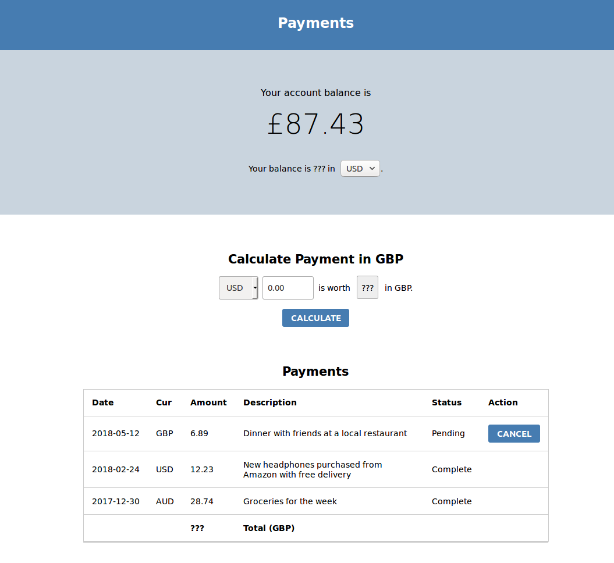

# Payments App

This repository contains initial work on a payments app. To complete the app, you'll need to add functionality so that payments can be recorded in any currency and the balance can be updated correctly.

You will need to know the exchange rates. You can get exchange rates for today and any past date from the API at [https://exchangeratesapi.io/](https://exchangeratesapi.io/).

This repository is part of CodeYourFuture's [group projects](https://github.com/CodeYourFuture/group-projects).

## What you need to do

- Replace the "???" below the account balance. It should show the account balance in the currency which is selected on the right. When the user changes the selection, it should update the value.
- Allow the user to calculate the value in GBP of a payment in any currency with the "Calculate Payment" form. When the "Calculate" button is pressed, it should show the value in GBP.
- Replace the information in the `Payments` component with the data in `/data/payments.js`. When completed you should see 5 payments.
- Make "???" in the payments table show the total of all payments in GBP.

## Stretch goals

- Add a "Make Payment" button to the "Calculate Payment" form. When a payment is made, it should appear in the payments table and the balance should be updated.
- Put Pending and Complete payments into separate tables. Update their total counts to only include the payments in each table
- Implement the "Cancel" button on pending payments. When clicked, it should remove the payment and the balance should be updated.
- Try to use the exchange rate for the date of each payment. Read the API documentation to learn how to get exchange rates for previous days.
- Don't allow a new payment to be made if it will cause the balance to drop below £0.00.
