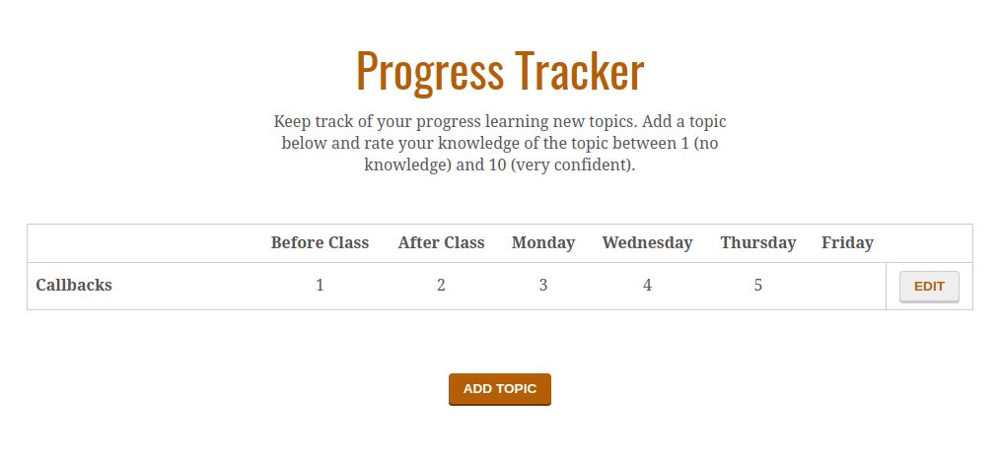

# Progress Chart

This repository contains initial work on an app to track the progress of a student's knowledge. To complete the app, you'll need to implement the functions which allow a visitor to add a topic and enter their progress.

This repository is part of CodeYourFuture's [group projects](https://github.com/CodeYourFuture/group-projects).

## What you need to do

- Create a [MongoDB](https://www.mongodb.com/) database and a collection to store topics.
- Move the [existing data](data) into the database.
- Create a [form](http://marksheet.io/html-forms.html) which allows a user to add a topic and enter their progress for `Before Class`, `After Class`, `Monday`, `Wednesday`, `Thursday` and `Friday`. The new topic should be saved to the database and loaded into the table with any existing topics.
- Allow the user to edit the progress for a topic by clicking that topic's **Edit** button.

## Stretch goals

- Try to implement the add and edit features using only [ajax requests](https://developer.mozilla.org/en-US/docs/AJAX/Getting_Started).
- Try to add a **Delete** button to delete a topic.
