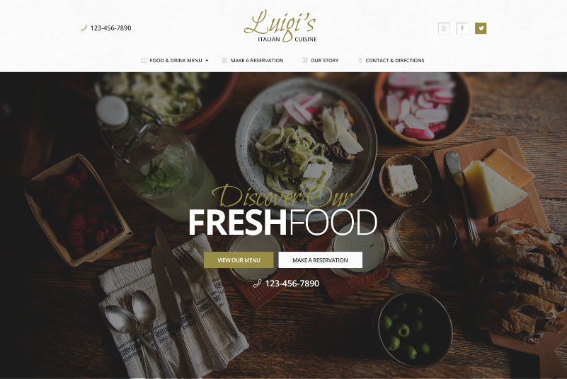

# Luigi - Build a Restaurant Website

You work in a small, creative web development agency that has been hired to create a new website for Luigi, an Italian restaurant. The project manager and the designer on your team have worked together to create a design mockup of the site. The client has signed off and now it's your job to turn the design into a website using HTML, CSS and JavaScript.

## First Steps

1. Look over the [design mockups](mockups) and [resources](resources) to see if you have all the information you need to build the website. Ask for any information or resources you're missing to do your job.
2. Discuss how the project can be divided up into separate tasks and assign responsibilities.
3. Read the rest of this document before beginning.

## Final Product

When you complete the project, we'll expect the following:

1. A new git repository with three pages that we can browse between: the homepage, menu and reservations. All students in the group should have contributed to this repository via Pull Requests.
2. A responsive design that is easy to use on mobile phones, tablets and laptops.
3. Attention to detail when implementing the designer's typography, colors, layout and photos. (See the [style guide](mockups/style-guide.png))
4. Clean, semantic HTML code.
5. Well-structured CSS code that makes use of re-usable components.
6. The date and time fields on the reservation form should make use of [pickadate.js](http://amsul.ca/pickadate.js/) to select a date and time.
7. When the reservation form is submitted, it should be validated to ensure that the Date, Time, Party, Name and Email fields are complete. If a phone number is entered, it should only contain numbers. When the form is not valid, show an error message.
8. It should be possible to browse the site with a keyboard (using <kbd>TAB</kbd>), and easy to see where the focus is at any time.
