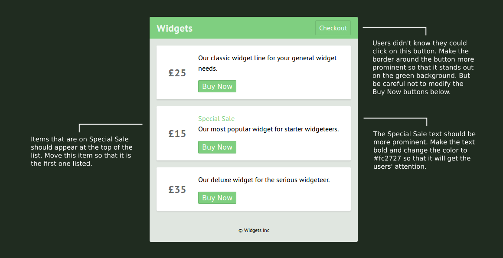

# Changes Requested on Shopping App

You work in a small development team responsible for the online shop of Widget Inc. Following user testing, your team leader has requested that a few changes be made to the application.

## First Steps

1. Ask your project leader to set up a group repository based on the [sample repository](https://github.com/CodeYourFuture/group-project-revisions-shop).
2. Make sure each member in the group has forked from your project leader's repository.
3. Read the instructions in the image above. Do you understand what's expected of you?
4. Discuss with your group how to divide up the project and assign responsibilities.
5. Read the rest of this document before beginning.

## Final Product

When you complete the project, we'll expect to be able to clone the `master` branch of your group repository and see the app with everyone's changes in place. (Read our instructions on [how to fork and clone](https://codeyourfuture.github.io/syllabus-master/others/making-a-pull-request.html).)

Be sure to alert the mentors when you have finished so that we can review it.
